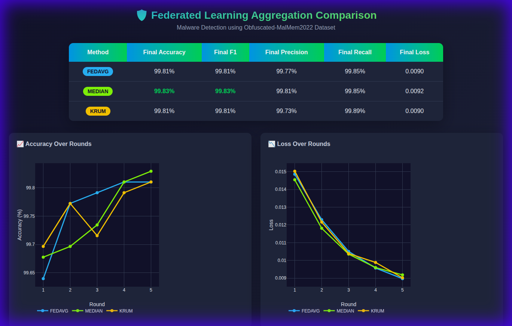

# Experiment Results: Federated Learning Aggregation Comparison

## Overview

This document presents the experimental results comparing three aggregation strategies for federated malware detection:

- **FedAvg** (Federated Averaging) - Standard weighted averaging
- **Median** - Byzantine-resilient median aggregation
- **Krum** - Byzantine-fault tolerant selection

## Experiment Configuration

| Parameter | Value |
|-----------|-------|
| Dataset | Obfuscated-MalMem2022 |
| Model | Logistic Regression |
| Number of Clients | 2 |
| Number of Rounds | 5 |
| Local Epochs | 2 |
| Batch Size | 32 |
| Learning Rate | 0.05 |

## Results Summary

### Final Performance Comparison

| Method | Final Accuracy | Final F1 | Final Precision | Final Recall | Final Loss |
|--------|---------------|----------|-----------------|--------------|------------|
| **FedAvg** | 99.81% | 99.81% | 99.77% | 99.85% | 0.0090 |
| **Median** | **99.83%** | **99.83%** | **99.81%** | 99.85% | 0.0092 |
| **Krum** | 99.81% | 99.81% | 99.73% | **99.89%** | 0.0090 |

> [!NOTE]
> All three methods achieve excellent performance (>99.8% accuracy) on the malware detection task. The differences are marginal in this controlled experiment without adversarial clients.

## Performance Over Training Rounds

### Accuracy Progression

| Round | FedAvg | Median | Krum |
|-------|--------|--------|------|
| 1 | 99.64% | 99.68% | 99.70% |
| 2 | 99.77% | 99.70% | 99.77% |
| 3 | 99.79% | 99.73% | 99.72% |
| 4 | 99.81% | 99.81% | 99.79% |
| 5 | 99.81% | 99.83% | 99.81% |

### Loss Progression

| Round | FedAvg | Median | Krum |
|-------|--------|--------|------|
| 1 | 0.0149 | 0.0145 | 0.0150 |
| 2 | 0.0123 | 0.0118 | 0.0122 |
| 3 | 0.0105 | 0.0104 | 0.0104 |
| 4 | 0.0096 | 0.0096 | 0.0099 |
| 5 | 0.0090 | 0.0092 | 0.0090 |

## Dashboard Screenshot

## Key Findings

### 1. All Methods Converge Rapidly
All three aggregation strategies converge to >99.7% accuracy within just 2-3 rounds, demonstrating the effectiveness of federated learning for malware detection.

### 2. Median Shows Slight Edge
The **Median** aggregation achieved the highest final accuracy (99.83%) and F1 score, making it a good default choice when Byzantine resilience is desired.

### 3. Krum Has Highest Recall
**Krum** achieved the highest recall (99.89%), meaning it missed fewer malware samples. This is critical in security applications where false negatives are costly.

### 4. Loss Comparison
FedAvg and Krum achieve the lowest final loss (0.0090), while Median is slightly higher (0.0092). This suggests that robust aggregation may trade off some optimization precision for resilience.

## Recommendations

| Scenario | Recommended Method |
|----------|-------------------|
| No adversarial clients expected | **FedAvg** (fastest, simplest) |
| Potential Byzantine clients | **Median** (good balance) |
| High security, minimize false negatives | **Krum** (highest recall) |
| Unknown threat model | **Median** or **Krum** |

## Conclusion

All three federated aggregation strategies perform exceptionally well for malware detection on the Obfuscated-MalMem2022 dataset. The choice between them should be based on:

1. **Trust model**: If all clients are trusted, FedAvg is sufficient
2. **Adversarial robustness**: Use Median or Krum when Byzantine clients may exist
3. **Detection priority**: Use Krum to minimize missed detections

The implemented system with real-time monitoring dashboard provides a solid foundation for production federated malware detection deployments.
