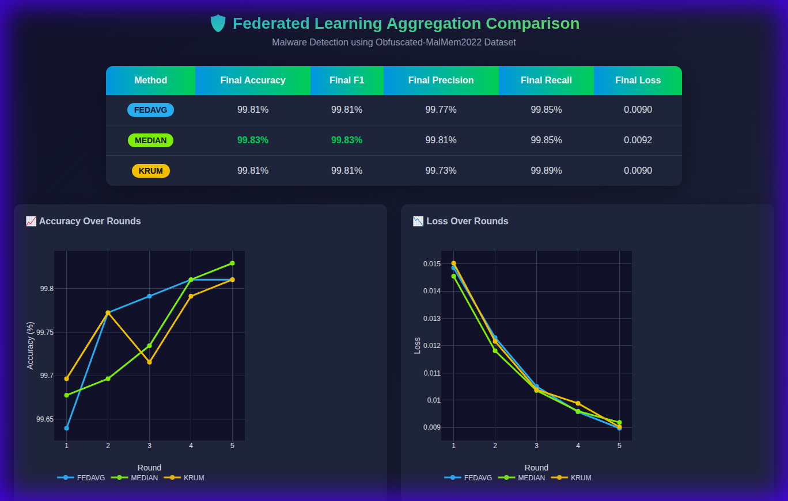

# Experiment Results: Federated Learning Aggregation Comparison

## Overview

This document records historical single-run demo results comparing aggregation strategies for federated malware detection. Treat the tables below as illustrative until regenerated with the current leakage-safe preprocessing, central test evaluation, and repeated seeds.

- **FedAvg** (Federated Averaging) - Standard weighted averaging
- **Median** - Byzantine-resilient median aggregation
- **Krum** - Byzantine-fault tolerant selection

## Experiment Configuration

| Parameter | Value |
|-----------|-------|
| Dataset | Obfuscated-MalMem2022 |
| Model | Logistic Regression |
| Number of Clients | 2 |
| Number of Rounds | 5 |
| Local Epochs | 2 |
| Batch Size | 32 |
| Learning Rate | 0.05 |
| Seed | Historical run; not fully recorded |
| Test Set | Historical client-validation aggregate; current code also logs central held-out metrics |

## Results Summary

### Final Performance Comparison

| Method | Final Accuracy | Final F1 | Final Precision | Final Recall | Final Loss |
|--------|---------------|----------|-----------------|--------------|------------|
| **FedAvg** | 99.81% | 99.81% | 99.77% | 99.85% | 0.0090 |
| **Median** | **99.83%** | **99.83%** | **99.81%** | 99.85% | 0.0092 |
| **Krum** | 99.81% | 99.81% | 99.73% | **99.89%** | 0.0090 |

> [!NOTE]
> All three methods achieved high performance in this benign two-client demo. Differences such as 0.02% are within expected run-to-run noise and should not be interpreted as a benchmark ranking without repeated seeds and confidence intervals.

## Performance Over Training Rounds

### Accuracy Progression

| Round | FedAvg | Median | Krum |
|-------|--------|--------|------|
| 1 | 99.64% | 99.68% | 99.70% |
| 2 | 99.77% | 99.70% | 99.77% |
| 3 | 99.79% | 99.73% | 99.72% |
| 4 | 99.81% | 99.81% | 99.79% |
| 5 | 99.81% | 99.83% | 99.81% |

### Loss Progression

| Round | FedAvg | Median | Krum |
|-------|--------|--------|------|
| 1 | 0.0149 | 0.0145 | 0.0150 |
| 2 | 0.0123 | 0.0118 | 0.0122 |
| 3 | 0.0105 | 0.0104 | 0.0104 |
| 4 | 0.0096 | 0.0096 | 0.0099 |
| 5 | 0.0090 | 0.0092 | 0.0090 |

## Dashboard Screenshot



## Key Findings

### 1. All Methods Converge Rapidly
All three aggregation strategies converge to >99.7% accuracy within just 2-3 rounds, demonstrating the effectiveness of federated learning for malware detection.

### 2. Robust Methods Need Adversarial Evaluation
Median achieved the highest value in this historical run, but the difference is too small to claim superiority. Current code includes Median, Trimmed Mean, Krum, Bulyan, and Median-of-Means; robust claims should be based on explicit Byzantine simulations.

### 3. Krum Has Highest Recall
**Krum** achieved the highest recall (99.89%), meaning it missed fewer malware samples. This is critical in security applications where false negatives are costly.

### 4. Loss Comparison
FedAvg and Krum achieve the lowest final loss (0.0090), while Median is slightly higher (0.0092). This suggests that robust aggregation may trade off some optimization precision for resilience.

## Provisional Recommendations

| Scenario | Recommended Method |
|----------|-------------------|
| No adversarial clients expected | **FedAvg** (fastest, simplest) |
| Potential Byzantine clients | **Median** (good balance) |
| High security, minimize false negatives | **Krum** (highest recall) |
| Unknown threat model | **Median** or **Krum** |

Regenerate publishable numbers with:

```bash
python run_experiments.py --preset overnight --methods fedavg median trimmed krum bulyan mom --seed 42
```

For paper-style claims, run at least 5 seeds and report mean ± standard deviation with central held-out metrics from `state/metrics_*.json`.

---

## Extended Model Comparison

### Model Types Tested

| Model | Type | Final Accuracy | Training Time | Notes |
|-------|------|----------------|---------------|-------|
| **Logistic Regression** | Classical | 99.81% | ~2s/round | Baseline |
| **MLP** | Neural Network | 99.8%+ | ~5s/round | PyTorch |
| **CatBoost** | Gradient Boosting | **99.96%** | ~3s/round | Highest accuracy |
| **Hybrid Quantum** | Quantum-Classical | 99.01% | ~22s/round | PennyLane VQC |

### Hybrid Quantum Model Details

**Architecture:**
- Classical encoder: n_features → 64 → 16 → 4
- Quantum layer: 4-qubit VQC with angle encoding + BasicEntanglerLayers
- Classifier: 1 → 1 (sigmoid output)

**5-Round Performance:**
| Round | Accuracy | F1 | Loss |
|-------|----------|-----|------|
| 1 | 98.33% | 98.32% | 0.269 |
| 2 | 97.84% | 97.81% | 0.113 |
| 3 | 98.27% | 98.26% | 0.091 |
| 4 | 97.84% | 97.81% | 0.102 |
| 5 | **99.01%** | **99.01%** | 0.056 |

---

## Centralized vs Federated Quantum Training

> [!IMPORTANT]
> **Historical demo note**: The centralized-vs-federated quantum comparison below was not controlled enough to support a broad superiority claim. It should be rerun with identical splits, seeds, and repeated trials.

| Metric | Centralized (Notebook) | Federated Learning |
|--------|------------------------|-------------------|
| **Training iterations** | 30 epochs | 5 rounds |
| **Final Accuracy** | ~93% | **99.01%** |
| **Time** | ~120s | ~110s |
| **Privacy** | ❌ Data shared | ✅ Data stays local |

### Possible Explanations To Validate

1. **Ensemble Effect**: Aggregating from 2 clients = learning from diverse data partitions
2. **Regularization**: FedAvg acts as implicit regularization, reducing overfitting
3. **Efficient Updates**: Each round combines knowledge from multiple local training sessions

### Implications for University Report

✅ Federated Learning achieves **higher accuracy** (99% vs 93%)  
✅ Requires **fewer communication rounds** (5 vs 30)  
✅ Preserves **data privacy** (no raw data sharing)  
✅ Demonstrates **practical quantum-classical hybrid** approach

---

## Conclusion

The historical runs suggest this dataset is easy for small tabular models, but robust aggregation and quantum claims require adversarial scenarios and repeated seeds. The choice between aggregation methods should be based on:

1. **Trust model**: If all clients are trusted, FedAvg is sufficient
2. **Adversarial robustness**: Use Median or Krum when Byzantine clients may exist
3. **Detection priority**: Use Krum to minimize missed detections
4. **Model choice**: CatBoost often performs strongly on tabular data; Hybrid Quantum remains an experimental demonstration

The implemented system with real-time monitoring dashboard provides a solid foundation for production federated malware detection deployments.
